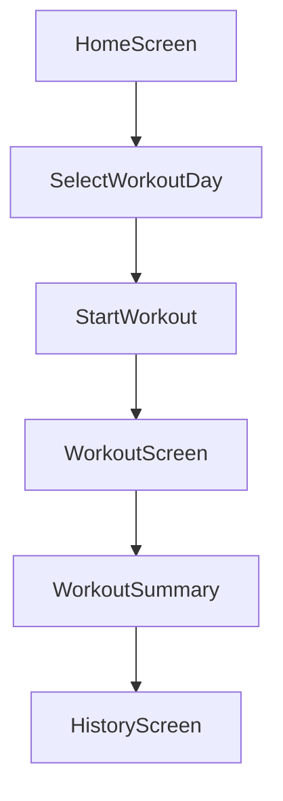

# Workout Tracker App Plan

## High-level architecture

- **Client app**: React Native + Expo + TypeScript, mobile-first, targeting iOS and Android.
- **Navigation**: Expo Router (recommended) or React Navigation with a simple stack: `Home` → `Workout` → `Summary` → `History`.
- **State management**: Start with React hooks + context; introduce a lightweight store (e.g. Zustand) only if state grows complex.
- **Data storage for MVP**: Local-only using Expo SQLite or AsyncStorage/MMKV. Design models so they can later map cleanly to Supabase tables.
- **Backend (later phase)**: Supabase (Postgres + auth) for sync, user accounts, and central data; OpenAI/GPT API for AI Trainer.

## Data model (MVP, local)

- **WorkoutDayType**: enum-like string: `"push" | "pull" | "legs"` (later extendable to custom plans).
- **Exercise**:
  - `id`
  - `name` (e.g. "Bench Press")
  - `dayType` (push/pull/legs)
  - `primaryMuscles: string[]` (e.g. ["chest","triceps"])
- **WorkoutSession**:
  - `id`
  - `date` (ISO string)
  - `dayType`
  - `notes` (optional)
- **WorkoutSet**:
  - `id`
  - `sessionId`
  - `exerciseId`
  - `setNumber`
  - `weight` (number)
  - `reps` (number)

These structures can later map almost 1:1 to Supabase tables.

## Phase 0 – Project setup

- **Create Expo app**: `npx create-expo-app@latest` with TypeScript template.
- **Install basics**:
  - Expo Router or React Navigation
  - A local storage solution (start with AsyncStorage for speed; consider Expo SQLite later for richer queries).
- **Set up global theme**: light/dark-aware, large touch targets, mobile-first spacing and typography.

## Phase 1 – Core flow: select workout day and start session

- **Home screen** (`HomeScreen`):
  - Shows **today's date** prominently.
  - Dropdown or segmented control to choose `Push`, `Pull`, or `Legs`.
  - `Start Workout` button to create a new `WorkoutSession` record (in local storage) and navigate to `WorkoutScreen`.
- **Implementation notes**:
  - Encapsulate session creation logic in a `useCreateSession` hook or a small `workoutSessionService` module.
  - Keep the UI minimal but clean: date, selection, and a single call-to-action.

## Phase 2 – Workout screen and set logging

- **Workout screen** (`WorkoutScreen`):
  - Reads the current `WorkoutSession` (via route params or context).
  - Shows the selected day type (`Push`/`Pull`/`Legs`).
  - Displays a searchable list of exercises for that day type.
  - For each selected exercise:
    - Show existing sets for this session.
    - Provide inputs for `weight` and `reps`.
    - Add/remove set buttons.
- **Data behavior**:
  - When user adds/edits a set, immediately persist to local storage.
  - Consider optimistic updates in state and batch writes to storage for performance.
- **UX details**:
  - Default new set's weight/reps to last set for that exercise in this session (or last session of same type, later).
  - Keep keyboard behavior friendly (auto-focus next input, avoid layout jumps).

## Phase 3 – Finish workout and basic summary

- **Finish flow**:
  - Add `Finish Workout` button on `WorkoutScreen`.
  - On tap, navigate to `WorkoutSummary` screen for that session.
- **Summary screen** (`WorkoutSummary`):
  - Show session date, day type, total volume per exercise (sum of weight × reps).
  - Simple list grouped by exercise with sets underneath.
  - Store a `completedAt` timestamp on the session when finished.

## Phase 4 – History and progression charts

- **History screen** (`HistoryScreen`):
  - List past sessions grouped by date/day type.
  - Tap into a session to view its `WorkoutSummary` again.
- **Progression data**:
  - For each exercise, compute over time:
    - Best set weight per session.
    - Total volume per session.
  - Determine change vs **previous session of same day type** and exercise.
    - If current best weight > previous best by ≥ 1 unit, show an up arrow and `+X lbs`.
- **Charts**:
  - Use a simple RN chart library (e.g. Victory Native or Recharts for RN web, depending on Expo support) to plot weight/volume over time.
  - Start with one chart per exercise, accessible from `History` or from an `ExerciseDetail` view.

## Phase 5 – Polishing MVP

- **UX polish**:
  - Improve typography, spacing, color palette for a clean, ad-free feel.
  - Add simple onboarding to explain Push/Pull/Legs concept and where to find history.
- **Data stability**:
  - Add schema versioning for local data (so future migrations to Supabase are easier).
  - Implement basic backup/export option (e.g. JSON export) if desired.

## Phase 6 – Prepare for Supabase and auth (beyond current MVP)

- **Supabase schema (future)**:
  - Tables matching local models: `profiles`, `exercises`, `workout_sessions`, `workout_sets`, `plans`.
  - Migrate from local IDs to Supabase UUIDs while retaining mapping.
- **Auth**:
  - Add Supabase email/password (and optionally OAuth) for user accounts.
  - Sync local data to Supabase when logged in; keep offline-first behavior.

## Phase 7 – AI Trainer (future)

- **Phase 1 AI**:
  - After a completed workout, send a structured summary of the session (exercises, sets, volumes, recent history) to the GPT API.
  - Prompt model to return a concise breakdown: muscles hit well, undertrained areas, suggestions for next session.
- **Phase 2 AI**:
  - In-workout chat assistant: context-aware of current session and past history.
  - Suggest weight progression, exercise substitutions, and form cues (via text only).

## Tech stack recommendations

- **Keep**: React Native + Expo + TypeScript – ideal for this use case.
- **Navigation**: Prefer Expo Router for file-based routing and good defaults; or React Navigation if you prefer manual route config.
- **Local storage**:
  - Start with AsyncStorage or MMKV for speed and simplicity.
  - If/when queries become more complex (e.g. aggregations for large histories), introduce Expo SQLite or an ORM (Drizzle/WatermelonDB) and migrate.
- **Supabase**: Delay until after local MVP is solid. When added, use it primarily for sync + auth, not for every read/write from day one.
- **AI**: Use OpenAI/GPT API with robust prompt design and small, structured payloads derived from your local/Supabase data.

This plan keeps your **first milestone small** (day selection, workout logging, basic summaries) while **structuring data and screens** so you can layer on history analytics, Supabase sync, and AI Trainer without large rewrites later.
